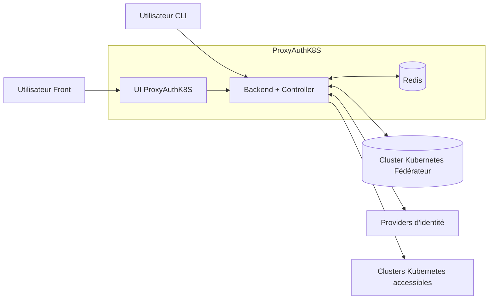

ProxyAuthK8S tourne dans un cluster Kubernetes "maitre" qui est un cluster Kubernetes fédérateur.

Ce cluster est utilisé pour faire tourner les composants de ProxyAuthK8S et pour stocker les CRD qui contiennent les informations sur les clusters cibles et les utilisateurs.

La CRD est conçue (et évolue) pour stocker le moins d'informations critiques possible pour éviter les risques de sécurité en cas de compromission du cluster maître. À terme, un maximum d'informations devrait être stocké dans des secrets externes (ex: Vault, Kubernetes Secrets) et la CRD ne devrait contenir que des références à ces secrets.

Un seul binaire fourni:

- Un controller Kubernetes qui s'occupe de la réconciliation des CRD
- Une API desservant une UI et une API pour les utilisateurs CLI
- Un proxy qui redirige les requêtes vers les clusters cibles en fonction des droits d'accès de l'utilisateur

## HA du backend et du controller

Le backend et le controller sont conçus pour être hautement disponibles. Ils peuvent être déployés en plusieurs réplicas dans le cluster maître.

La partie controller effectue une élection de leader pour éviter les conflits lors de la réconciliation des CRD. Seul le leader effectue la réconciliation, les autres réplicas sont en standby.

L'élection du leader est effectuée a l'aide de l'api [lease](https://kubernetes.io/docs/concepts/architecture/leases/) de Kubernetes.

La partie backend est conçue pour être stateless, elle peut donc être répliquée sans problème. Les sessions utilisateurs et les informations d'état sont stockées dans Redis pour permettre la scalabilité du backend.

## Authentification

L'application utilisé 1n provider d'identité pour l'authentification des utilisateurs. L'interface et les api a destination des utilisateurs nécessitent un provider OIDC/Oauth2 pour l'authentification.

Concernant la partit redirection trois cas sont actuellement gérés:

- Cluster avec un provider OIDC: dans ce cas, l'utilisateur est redirigé vers le provider d'identité du cluster cible pour s'authentifier et obtenir un token d'accès.
- Cluster sans provider OIDC: dans ce cas, le jeton est tout de même validé contre le cluster cible avant de rediriger la requête.
- Cluster sans validation, dans ce cas, aucune validation n'est effectuée et la requête est redirigée directement vers le cluster cible. Ce mode est à éviter pour des raisons de sécurité, mais il peut être utile pour les clusters de test ou les clusters internes qui ne sont pas exposés à Internet.

## Redirection des requêtes

Le backend redirige les requêtes des utilisateurs vers les clusters cibles en fonction dee la validation mise en place (validation contre le provider d'identité ou validation contre le cluster cible) et des droits d'accès identifiés dans la CRD.

## Reconciliation des CRD

Le controller s'occupe de la réconciliation des CRD qui contiennent les informations sur les clusters cibles et les utilisateurs. Il met à jour le status de la CRD avec son path et/ou si il est exposé.

Avant de remplir le status de la CRD, le controller effectue des vérifications pour s'assurer que les informations contenues dans la CRD sont valides et que le cluster cible est accessible et/ou actif. Ces vérifications incluent:

- Vérification de la connectivité au cluster cible
- Vérification de la validité du certificat fournit pour le cluster cible ou que le cluster cible possède un certificat globalement reconnu.
- Vérification de la validité de la configuration fournit pour le cluster cible (ex: présence des champs nécessaires, format de la configuration, etc.)
