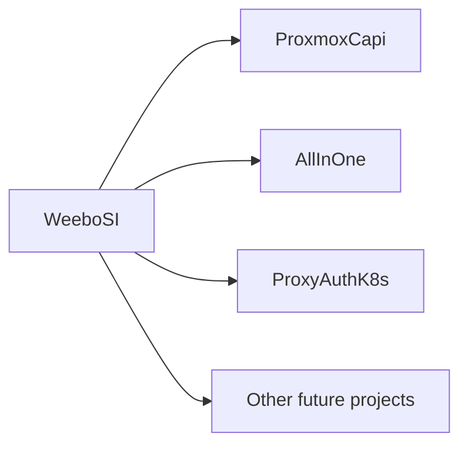

Ce projet est une bifurcation dans un projet plus global nommé [WeeboSI](https://batleforc.github.io/weebo-si/) qui a pour but de jouer avec certaines technologies à mi-chemin entre l'infra, le dev et plein d'autres trucs vachement cool.

Le but de ce projet est de créer un point d'entrée facilité pour plusieurs clusters Kubernetes tout en agrégeant des fonctionnalités de sécurité et d'authentification. Il s'agit d'un projet qui évoluera au fil du temps, avec des fonctionnalités supplémentaires et de l'amélioration continue.
