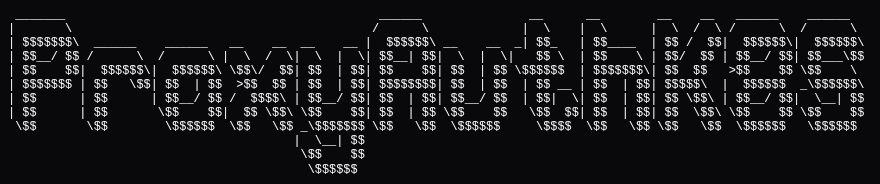

# ProxyAuthK8s

ProxyAuthK8S is a part of the Weebo Si project, this project is focused on exposing Kube api server with focus on security and ease of use.

In addition to the secured exposure, this project also eases the sharing of kubeconfig files between users and teams.

The base specification of the [project can be found here](https://batleforc.github.io/weebo-si/0.projects/reverse-api-kube-oidc-based.html).

## Useful links

- [Controller-rs](https://github.com/kube-rs/controller-rs/blob/main/src/controller.rs)
- [Monodon nx](https://github.com/cammisuli/monodon/tree/main/packages/rust)
- [dispatch](https://actix.rs/docs/url-dispatch/)

## TRACING

Move back to [Tracing Actix Web](https://github.com/LukeMathWalker/tracing-actix-web/pull/144) has it handle the tracing framework THAT I LOVE SO MUCH! (and the old lib does nothing that i want)

## API Endpoints

[More info about the api here](libs/api/readme.md)
