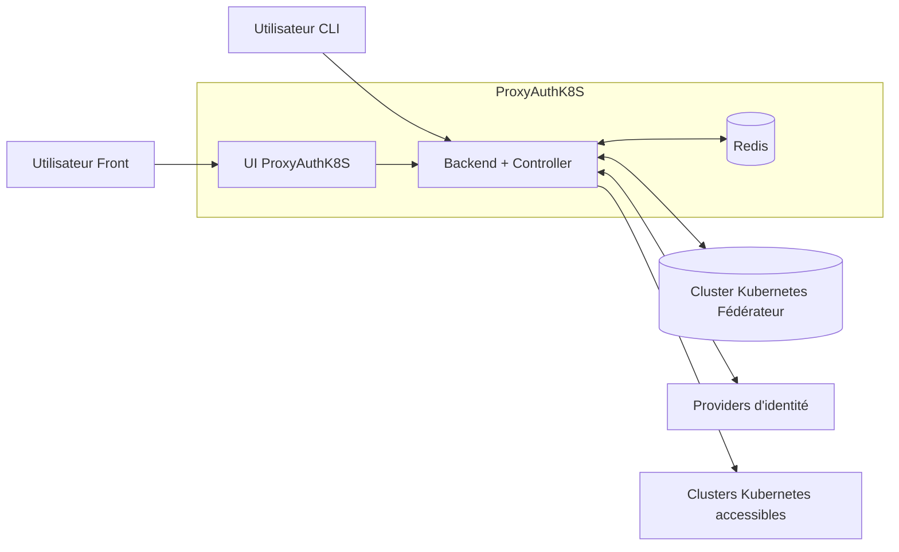

# ProxyAuthK8s

ProxyAuthK8S is a part of the Weebo Si project, this project is focused on exposing Kube api server with focus on security and ease of use.

In addition to the secured exposure, this project also eases the sharing of kubeconfig files between users and teams.

The base specification of the [project can be found here](https://batleforc.github.io/weebo-si/0.projects/reverse-api-kube-oidc-based.html).

## Architecture

N'oublier pas de mettre une brique d'exposition entre les utilisateurs et la brique ProxyAuthK8S.

## Left to do

### v0.2.0

- [ ] Create Krew plugin for easier usage
  - <https://github.com/davidB/kubectl-view-allocations/tree/master>
  - <https://github.com/kubernetes-sigs/krew-index/blob/master/plugins/view-allocations.yaml>
  - name: `proxyauthk8s`
  - <https://docs.rs/clap/latest/clap/>

### v0.3.0

- [ ] Add more tests
- [ ] Add documentation
  - [ ] How to Deploy ProxyAuthK8s
  - [ ] How to use Kubectl ProxyAuth plugin
  - [ ] How to use the UI
  - [ ] How to add new Kubernetes API to ProxyAuthK8S
  - [ ] Architecture overview
  - [ ] API documentation
  - [ ] How to contribute
  - [ ] How to setup development environment
- [ ] Add security features (details later)
- [ ] Add Oidc token validation
- [ ] Add ability to go through a proxy (exemple with Netbird)

### v0.4.0

- [ ] Setup Exchange token between IdP and ProxyAuthK8S main auth server
