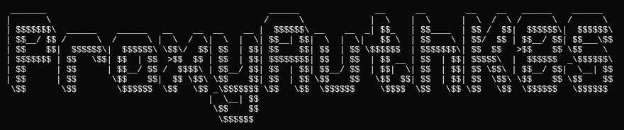
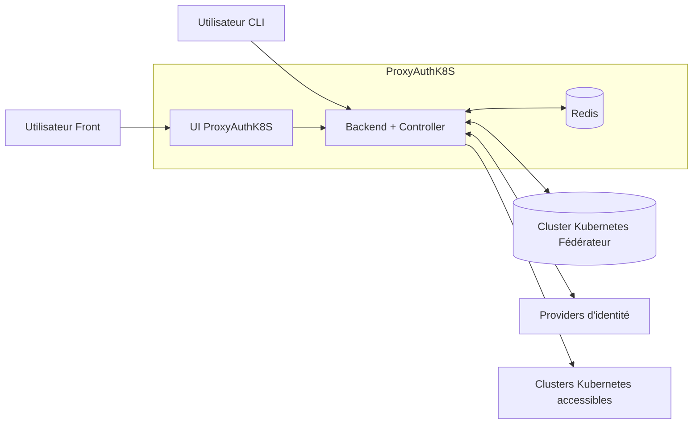

# ProxyAuthK8s

ProxyAuthK8S is a part of the Weebo Si project, this project is focused on exposing Kube api server with focus on security and ease of use.

In addition to the secured exposure, this project also eases the sharing of kubeconfig files between users and teams.

The base specification of the [project can be found here](https://batleforc.github.io/weebo-si/0.projects/reverse-api-kube-oidc-based.html).

## Architecture

```mermaid
flowchart LR
  UF[Utilisateur Front] --> UI
  UC[Utilisateur CLI] --> BE

  subgraph PX[ProxyAuthK8S]
    UI[UI ProxyAuthK8S]
    BE[Backend + Controller]
    R[(Redis)]
  end

  UI --> BE
  BE <--> R
  BE <--> KC[(Cluster Kubernetes Fédérateur)]
  BE <--> IDP[Providers d'identité]
  BE --> KX[Clusters Kubernetes accessibles]
```

N'oublier pas de mettre une brique d'exposition entre les utilisateurs et la brique ProxyAuthK8S.

## Left to do

### v0.1.0

- [x] Create a CRD to store target cluster
- [x] Validate the CRD against certain rules
- [x] Authenticate users against an Oidc Provider for the UI and filter dashboard based on the user groups
- [x] Create a UI
  - [x] List User's accessible clusters
  - [x] Login to cluster's OIDC if provider is OIDC and show kubeconfig
  - [x] Show kubeconfig in case of non OIDC provider
  - [x] Generate the Api client from the Swagger documentation of the API
- [x] Controller
  - [x] Reconcile CRD and update the status with the cluster accessibility for the user
  - [x] Handle CallBack from OIDC provider and update the status
  - [x] Handle HA of the controller with leader election
- [x] Backend
  - [x] Expose API for the UI
  - [x] Redirect each request to the right cluster based on the user and the cluster accessibility
  - [x] Validate the token either against the OIDC provider or kube itself before redirecting the request
  - [x] Handle HA of the backend with state storage in Redis
  - [x] Generate the Swagger documentation for the API
- [ ] CI/CD
  - [x] On each commit
    - [x] Run CodeQL analysis
    - [x] Rust Deeper analysis including CVE
    - [x] Front Lint and CVE
  - [x] In case of TAG on main, if not ignored the tag and need to be in the format vX.X.X
    - [x] Build and push Docker image to GHCR
    - [x] Build and push Helm chart to GHCR
    - [x] Create a draft-release on GitHub with the changelog
- [x] PRE-TAG
  - [x] Tag need to be in the format vX.X.X - Rules on repo
  - [x] Tag need to be done with cog by a human contributor - Rules on repo
  - [x] Each release need to have a name and a description in the changelog

### v0.2.0

- [ ] Add documentation
  - [ ] How to Deploy ProxyAuthK8s
  - [ ] How to use Kubectl ProxyAuth plugin
  - [ ] How to use the UI
  - [ ] How to add new Kubernetes API to ProxyAuthK8S
  - [ ] Architecture overview
  - [ ] API documentation
  - [ ] How to contribute
  - [ ] How to setup development environment
  - [ ] How to Release a new version
- [ ] Create Krew plugin for easier usage
  - <https://github.com/davidB/kubectl-view-allocations/tree/master>
  - <https://github.com/kubernetes-sigs/krew-index/blob/master/plugins/view-allocations.yaml>
  - name: `proxyauthk8s`
  - <https://docs.rs/clap/latest/clap/>
  - [x] Use an auto generated client from the OpenAPI spec of the API to interact with the API
- [ ] CI/CD
  - [ ] In case of TAG
    - [ ] Build and push Krew plugin to Krew Index
- [ ] Have a clean git history

### v1.0.0

- [ ] Add more tests
- [ ] Add [redis cluster](https://docs.rs/deadpool-redis/latest/deadpool_redis/#example-cluster) support for HA and state storage
- [ ] Add security features (details later)
  - [ ] Allow getting oidc configuration from an external secrets
- [ ] Add Oidc token validation
- [ ] CI/CD
  - [ ] In case of TAG
    - [ ] Publish the documentation on GitHub Pages

### v2.0.0

- [ ] Redesign the UI (I hate the current look of it)
- [ ] Setup Exchange token between IdP and ProxyAuthK8S main auth server
- [ ] Add ability to go through a proxy (exemple with Netbird)
- [ ] Setup Agent Mode, Allow to not expose each cluster to the world and just have an agent doing a tunnel between the Cluster ApiServer and ProxyAuthK8S
