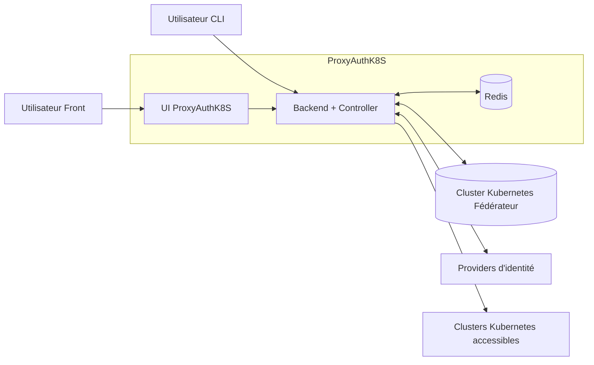

# ProxyAuthK8s

[](https://scorecard.dev/viewer/?uri=github.com/batleforc/ProxyAuthK8S)


ProxyAuthK8S is a part of the Weebo Si project, this project is focused on exposing Kube api server with focus on security and ease of use.

In addition to the secured exposure, this project also eases the sharing of kubeconfig files between users and teams.

The base specification of the [project can be found here](https://batleforc.github.io/weebo-si/0.projects/reverse-api-kube-oidc-based.html).


## Architecture


```mermaid
flowchart LR
  UF[Utilisateur Front] --> UI
  UC[Utilisateur CLI] --> BE

  subgraph PX[ProxyAuthK8S]
    UI[UI ProxyAuthK8S]
    BE[Backend + Controller]
    R[(Redis)]
  end

  UI --> BE
  BE <--> R
  BE <--> KC[(Cluster Kubernetes Fédérateur)]
  BE <--> IDP[Providers d'identité]
  BE --> KX[Clusters Kubernetes accessibles]
```

N'oublier pas de mettre une brique d'exposition entre les utilisateurs et la brique ProxyAuthK8S.

## Local dev with Keycloak (alternative IdP)

You can run ProxyAuthK8S with Keycloak instead of Authelia for local OIDC testing.

1. Enable Keycloak include in [compose.yaml](compose.yaml) and disable Authelia include.

1. Use the Keycloak env file.

1. Start the stack.

```sh
cp .env.keycloak .env
docker compose up -d
```

Keycloak URL (via Traefik): `https://keycloak.k8s.localhost`

The imported realm is [realm-proxyauthk8s.json](.compose/keycloak/realm-proxyauthk8s.json) and already contains:

- realm: `proxyauthk8s`
- client `proxyauthk8s` (front login)
- client `kube_login` (cluster OIDC)
- users `dev-admin` / `dev-user`

## Local dev with Dex (alternative IdP)

Dex is the closest match to the "IdP in front of the cluster" topology: its
`/userinfo` verifies the bearer as a signed ID token, which is exactly the token
the CLI stores and forwards, and the same token is what the target apiserver
validates when started with `--oidc-issuer-url=https://dex.k8s.localhost`.

1. Enable the Dex include in [compose.yaml](compose.yaml) and disable the
   Authelia / Keycloak includes.

1. Use the Dex env file.

1. Start the stack.

```sh
cp .env.dex .env
docker compose up -d
```

Dex URL (via Traefik): `https://dex.k8s.localhost`

The config is [config.yaml](.compose/dex/config.yaml) and mirrors the Keycloak
realm:

- client `proxyauthk8s` (front login, public + PKCE)
- client `kube_login` (cluster OIDC, secret `insecure_secret`)
- users `dev-admin` / `dev-user` (password == username)

Two Dex specifics worth knowing:

- Set `extra_scope: "groups profile email"` on the `ProxyKubeApi` CR.
  `extra_scope` replaces the scope list rather than adding to it, and without
  the `groups` scope Dex omits the claim entirely.
- Leave `audience` empty and `accept_authorized_party: false`. Dex puts the
  client id in `aud`, so no `azp` workaround is needed (unlike Keycloak).

Dex's local password database asserts **no groups**, so the static users above
only reach clusters with no `proxy_group` restriction. To exercise
group-restricted clusters — and to model the "Authentik upstream, Dex in front of
the cluster" setup — uncomment the `oidc` connector at the bottom of the config
and point it at Keycloak or Authentik. It needs `insecureEnableGroups: true`;
the connector drops upstream groups otherwise.

## Roadmap

The roadmap (done, in progress and planned work) is maintained in a single place:
[the Roadmap page of the documentation](https://batleforc.github.io/ProxyAuthK8S/docs/roadmap)
(source: [`.docs/content/docs/roadmap.mdx`](.docs/content/docs/roadmap.mdx)).
