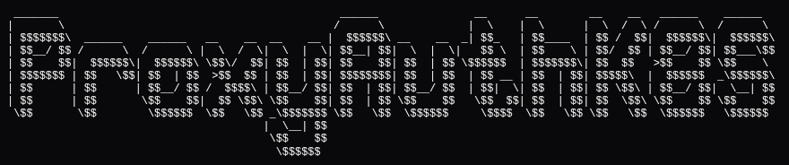
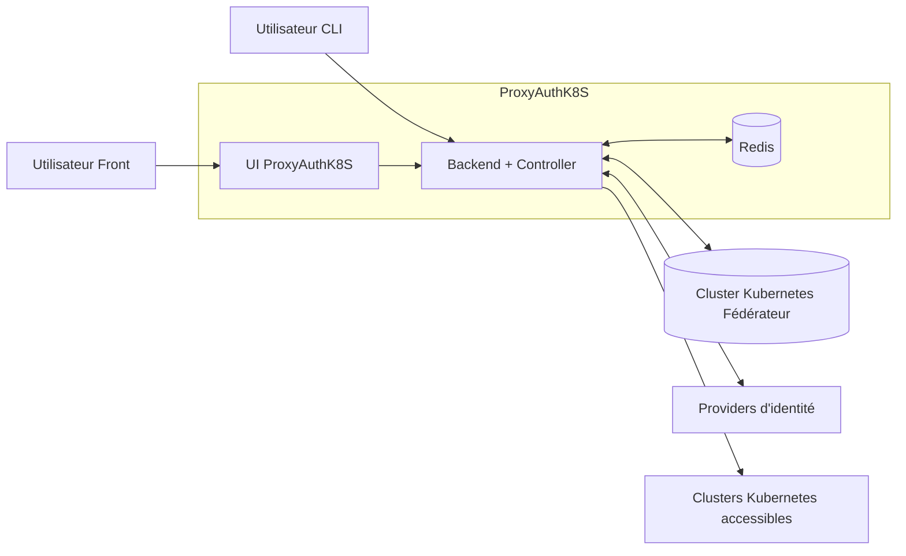

# ProxyAuthK8s

[](https://scorecard.dev/viewer/?uri=github.com/batleforc/ProxyAuthK8S)



ProxyAuthK8S is a part of the Weebo Si project, this project is focused on exposing Kube api server with focus on security and ease of use.

In addition to the secured exposure, this project also eases the sharing of kubeconfig files between users and teams.

The base specification of the [project can be found here](https://batleforc.github.io/weebo-si/0.projects/reverse-api-kube-oidc-based.html).


## Architecture


```mermaid
flowchart LR
  UF[Utilisateur Front] --> UI
  UC[Utilisateur CLI] --> BE

  subgraph PX[ProxyAuthK8S]
    UI[UI ProxyAuthK8S]
    BE[Backend + Controller]
    R[(Redis)]
  end

  UI --> BE
  BE <--> R
  BE <--> KC[(Cluster Kubernetes Fédérateur)]
  BE <--> IDP[Providers d'identité]
  BE --> KX[Clusters Kubernetes accessibles]
```

N'oublier pas de mettre une brique d'exposition entre les utilisateurs et la brique ProxyAuthK8S.

## Local dev with Keycloak (alternative IdP)

You can run ProxyAuthK8S with Keycloak instead of Authelia for local OIDC testing.

1. Enable Keycloak include in [compose.yaml](compose.yaml) and disable Authelia include.

1. Use the Keycloak env file.

1. Start the stack.

```sh
cp .env.keycloak .env
docker compose up -d
```

Keycloak URL (via Traefik): `https://keycloak.k8s.localhost`

The imported realm is [realm-proxyauthk8s.json](.compose/keycloak/realm-proxyauthk8s.json) and already contains:

- realm: `proxyauthk8s`
- client `proxyauthk8s` (front login)
- client `kube_login` (cluster OIDC)
- users `dev-admin` / `dev-user`

## Local dev with Dex (alternative IdP)

Dex is the closest match to the "IdP in front of the cluster" topology: its
`/userinfo` verifies the bearer as a signed ID token, which is exactly the token
the CLI stores and forwards, and the same token is what the target apiserver
validates when started with `--oidc-issuer-url=https://dex.k8s.localhost`.

1. Enable the Dex include in [compose.yaml](compose.yaml) and disable the
   Authelia / Keycloak includes.

1. Use the Dex env file.

1. Start the stack.

```sh
cp .env.dex .env
docker compose up -d
```

Dex URL (via Traefik): `https://dex.k8s.localhost`

The config is [config.yaml](.compose/dex/config.yaml) and mirrors the Keycloak
realm:

- client `proxyauthk8s` (front login, public + PKCE)
- client `kube_login` (cluster OIDC, secret `insecure_secret`)
- users `dev-admin` / `dev-user` (password == username)

Two Dex specifics worth knowing:

- Set `extra_scope: "groups profile email"` on the `ProxyKubeApi` CR.
  `extra_scope` replaces the scope list rather than adding to it, and without
  the `groups` scope Dex omits the claim entirely.
- Leave `audience` empty and `accept_authorized_party: false`. Dex puts the
  client id in `aud`, so no `azp` workaround is needed (unlike Keycloak).

Dex's local password database asserts **no groups**, so the static users above
only reach clusters with no `proxy_group` restriction. To exercise
group-restricted clusters — and to model the "Authentik upstream, Dex in front of
the cluster" setup — uncomment the `oidc` connector at the bottom of the config
and point it at Keycloak or Authentik. It needs `insecureEnableGroups: true`;
the connector drops upstream groups otherwise.

## Left to do

### v0.1.0

- [x] Create a CRD to store target cluster
- [x] Validate the CRD against certain rules
- [x] Authenticate users against an Oidc Provider for the UI and filter dashboard based on the user groups
- [x] Create a UI
  - [x] List User's accessible clusters
  - [x] Login to cluster's OIDC if provider is OIDC and show kubeconfig
  - [x] Show kubeconfig in case of non OIDC provider
  - [x] Generate the Api client from the Swagger documentation of the API
- [x] Controller
  - [x] Reconcile CRD and update the status with the cluster accessibility for the user
  - [x] Handle CallBack from OIDC provider and update the status
  - [x] Handle HA of the controller with leader election
- [x] Backend
  - [x] Expose API for the UI
  - [x] Redirect each request to the right cluster based on the user and the cluster accessibility
  - [x] Validate the token either against the OIDC provider or kube itself before redirecting the request
  - [x] Handle HA of the backend with state storage in Redis
  - [x] Generate the Swagger documentation for the API
- [x] CI/CD
  - [x] On each commit
    - [x] Run CodeQL analysis
    - [x] Rust Deeper analysis including CVE
    - [x] Front Lint and CVE
  - [x] In case of TAG on main, if not ignored the tag and need to be in the format vX.X.X
    - [x] Build and push Docker image to GHCR
    - [x] Build and push Helm chart to GHCR
    - [x] Create a draft-release on GitHub with the changelog
- [x] PRE-TAG
  - [x] Tag need to be in the format vX.X.X - Rules on repo
  - [x] Tag need to be done with cog by a human contributor - Rules on repo
  - [x] Each release need to have a name and a description in the changelog

### v0.2.0

- [ ] Add documentation
  - [x] How to Deploy ProxyAuthK8s
  - [ ] How to use Kubectl ProxyAuth plugin
  - [ ] How to use the UI
  - [ ] How to add new Kubernetes API to ProxyAuthK8S
  - [x] Architecture overview
  - [x] API documentation
  - [x] How to contribute
  - [x] How to setup development environment
  - [x] How to Release a new version
- [ ] Create Krew plugin for easier usage
  - <https://github.com/davidB/kubectl-view-allocations/tree/master>
  - <https://github.com/kubernetes-sigs/krew-index/blob/master/plugins/view-allocations.yaml>
  - name: `proxyauthk8s`
  - <https://docs.rs/clap/latest/clap/>
  - [x] Use an auto generated client from the OpenAPI spec of the API to interact with the API
- [ ] CI/CD
  - [ ] In case of TAG
    - [x] Build the plugin archives and render the Krew manifest
    - [ ] Open the PR against the Krew Index
  - [ ] Pin `actions/upload-artifact` and `actions/download-artifact` to a SHA in
        `release-prepare.yml`, like every other action in the workflows
- [ ] Have a clean git history

### v1.0.0

- [x] Add more tests
  - [x] Unit tests on the CRD, the path matcher and the security policy
  - [x] Fast integration tier (wiremock upstream + real Redis)
  - [x] envtest tier against a real ephemeral kube-apiserver
- [x] Add [redis cluster](https://docs.rs/deadpool-redis/latest/deadpool_redis/#example-cluster) support for HA and state storage
- [ ] Add security features
  - [x] Enforce `allowed_resources` on the proxy path
  - [x] Per-cluster authorization (`proxy_group`)
  - [x] Rate limiting and fail2login, backed by Redis counters
  - [x] Audit trail on every proxied request
  - [x] mTLS between the proxy and the target clusters
  - [x] CEL admission rules on the CRD
  - [ ] Local JWT validation against the `jwt` authenticators (signature, claim
        validation rules and claim mappings, as the apiserver's structured
        authentication configuration does)
  - [ ] Allow getting oidc configuration from an external secrets
- [x] Add Oidc token validation
- [x] Match allowed resources on group/version/kind (`AllowedCrdConfiguration`)
      instead of only on paths
- [ ] Drop the deprecated `allowed_ressources` spelling once resources have been
      migrated to `allowed_resources` (breaking, hence the next major)
- [ ] CI/CD
  - [ ] In case of TAG
    - [ ] Publish the documentation on GitHub Pages

### v2.0.0

- [ ] Redesign the UI (I hate the current look of it)
- [ ] Setup Exchange token between IdP and ProxyAuthK8S main auth server
- [ ] Add ability to go through a proxy (example with Netbird)
- [ ] Setup Agent Mode, Allow to not expose each cluster to the world and just have an agent doing a tunnel between the Cluster ApiServer and ProxyAuthK8S
