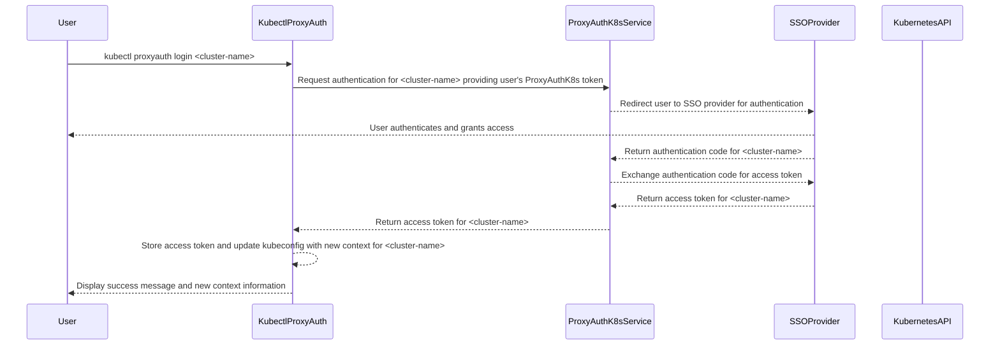
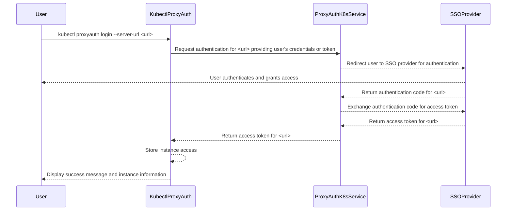
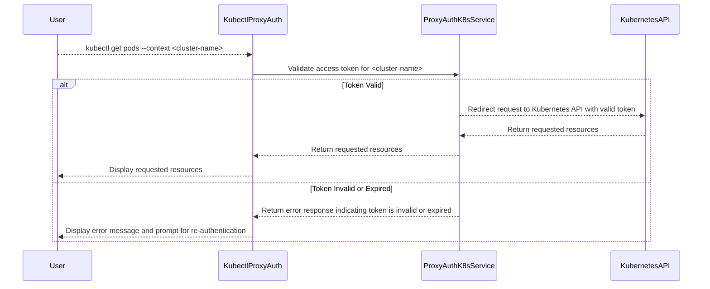
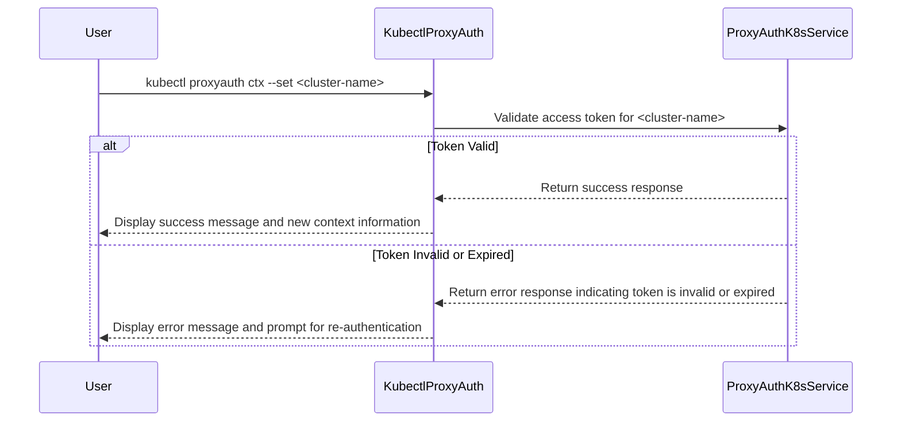
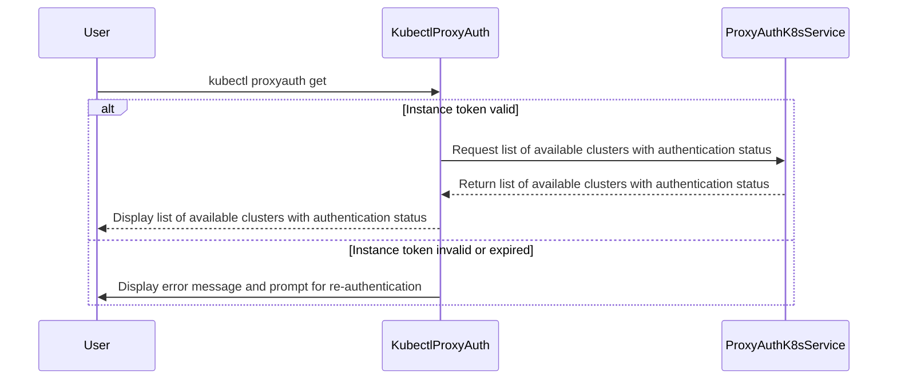

# Kubectl ProxyAuth

A `Kubectl` plugin to ease the burden of authenticating against multiple Kubernetes Cluster Apis through the ProxyAuthK8s service.

This document is only meant to describe the functionality of the plugin that needs to be developed.

## Overview

The `kubectl-proxyauth` plugin will allow users to authenticate against multiple Kubernetes clusters using the ProxyAuthK8s service. The plugin will handle the authentication process, making it easier for users to switch between different clusters without having to manually manage authentication tokens or credentials.

## Features

- **Default Parameters**: The plugin will use default parameters for the ProxyAuthK8s service, which can be overridden by user-provided configurations or environment variables.
  - `--namespace (-n) <namespace>` : Optionally specify a namespace to filter clusters, if none see only default ns one, if none readable in ns, send a no resource allowed in this ns.
  - `--kubeconfig (-k) <path>` : Optionally specify a kubeconfig file to use for authentication.
  - `--verbose (-v)` : Enable verbose logging for debugging purposes.
  - `--server-url (-s) <url>` : Optionally specify the ProxyAuthK8s service URL, if not provided will use the value from the config file or default to `http://localhost:8080`.
  - `--format (-f) <format>` : Specify the output format (e.g., json, yaml, table). Default is `table`.
- **Cluster Management**:
  - `get`
    - `<cluster-name>` : Retrieves details of the specified cluster.
    - If no cluster name is provided, lists all available clusters.
- **Authentication**:
  - `login`
    - `<cluster-name>` : If provided, logs into the specified cluster, if already logged in, will try return the token if still valid or refresh it.
    - If no cluster name is provided, will login to the application
    - `--token (-t) <token>` : Optionally provide a token for authentication, if not provided, will prompt the user to enter one.
  - `logout`
    - `<cluster-name>` : If provided, logs out from the specified cluster.
    - If no cluster name is provided, will logout from the application
  - `cache`
    - `clear` : Clears the cached authentication tokens for all clusters.
  - `get-token`
    - `<cluster-name>` : Retrieves the current authentication token for the specified cluster.
- **Context Handling**: The plugin will manage Kubernetes contexts to ensure that users are authenticated against the correct cluster.
  - [DONE] `ctx`
    - `<cluster-name>` : Get the specified context.
    - Output the current context if no cluster name is provided.
    - `--list (-l)` : Lists all available contexts, and which one come from ProxyAuthK8s or are active.
    - `--set (-s)` : Sets the current context to the specified cluster.
- **Configuration Management**: The plugin will support configuration files to store settings such as the ProxyAuthK8s service URL and default namespace.
  - [DONE] `config` : If no flags provided, shows current config
    - `get` : Displays the current configuration settings.
      - `--server-url (-s) <url>` : Filters the output by server URL.
      - `--namespace (-n) <namespace>` : Filters the output by namespace (by default show default ns settings).
      - `--list (-l)` : Lists all available configurations.
    - `clear` : Clears the configuration file, resetting all settings to defaults.
      - `--server-url (-s) <url>` : Sets the default ProxyAuthK8s service URL in the configuration file.
      - `--all (-a)` : Clears all configurations.
    - `set-def` : Sets configuration options.
      - `--default-server <server-name>` : Sets the CLI-wide default server name in the configuration file.
      - `--server-url <url>` : Adds or updates a server with its URL in the configuration file.
      - `--namespace (-n) <namespace>` : Sets the default namespace for a specific server (requires --server flag with server name only).
- **Help Command**: A `--help` flag will be available to provide users with information about the plugin's commands and usage.
- **Error Handling**: The plugin will handle errors gracefully, providing meaningful messages to the user in case of authentication failures or other issues.
  - Each error needs to have a unique ID for easier troubleshooting
  - Each error should be in the linked in the docs error section.
- **Configuration**:
  - Works with existing kubeconfig files or targeted ones.
  - The token cache will be handled like [Kubelogin](https://github.com/int128/kubelogin/blob/master/docs/usage.md#token-cache) has much as possible. [Rust keyring](https://crates.io/crates/keyring) can be used to store tokens in the keyring like kubelogin.
  - Another config file will be used to store where the ProxyAuthK8s service is located, and other plugin specific settings. (Ex: ~/.kube/proxyauth_config.yaml)

### Example Kubeconfig Exec Section

```yaml
  - name: admin@talos-default
    user:
      exec:
        apiVersion: client.authentication.k8s.io/v1beta1
        args:
          - proxyauth
          - get-token
          - -n default
          - -s https://proxyauthk8s.k8s.localhost
          - local-sso
        command: kubectl
        env: null
        provideClusterInfo: false
  - name: admin@talos-default
    user:
      exec:
        apiVersion: client.authentication.k8s.io/v1beta1
        args:
          - proxyauth
          - get-token
          - local-sso
        command: kubectl
        env: null
        provideClusterInfo: false
  - name: admin@talos-default # This one should be the one used by default, config should be load from the env var KUBERNETES_EXEC_INFO if set, either fallback to the config passed in arg.
    user:
      exec:
        apiVersion: client.authentication.k8s.io/v1
        args:
          - proxyauth
          - get-token
        command: bash
        env: null
        provideClusterInfo: true
        interactiveMode: Never
```

### Example config file (~/.kube/proxyauth_config.yaml)

```yaml
default_server_name: "localhost-5437" # Set on first run or via config command

servers:
  localhost-5437:                               # Cluster HORS PROD
    url: "http://localhost:5437"                # Server URL
    namespace: "default"                        # Default namespace for this server
    clusters:
      local-sso:
        token_exist: true                       # Means that a token exist, can be invalid or valid
      team-b/local-pas-sso:                     # NS == team-b and NAME == local-pas-sso
        token_exist: false
  proxyauthk8s-prod-localhost:                  # Cluster PROD
    url: "https://proxyauthk8s.prod.localhost"
    namespace: "WEEBO_EU_WEST"
    clusters:
      prod-cluster:                             # NS == WEEBO_EU_WEST and NAME == prod-cluster and url == https://proxyauthk8s.prod.localhost
        token_exist: false

```

## Basic Workflow

### Login to a Cluster with SSO



### Login to ProxyAuthK8s Service



### Get resources from a Cluster



### Switching Clusters



### Get Available Clusters



## Useful Links

- [Kubectl Plugin Development Guide](https://kubernetes.io/docs/tasks/extend-kubectl/kubectl-plugins/)
- [Krew example manifest in rust - view allocations](https://github.com/kubernetes-sigs/krew-index/blob/master/plugins/view-allocations.yaml)
- [Krew - Developer Guide](https://krew.sigs.k8s.io/docs/developer-guide/develop/plugin-development/)
- [Kubeconfig - Exec Config](https://kubernetes.io/docs/reference/config-api/kubeconfig.v1/#ExecConfig)
- [Kubectl - Exec Credential Spec v1](https://kubernetes.io/docs/reference/config-api/client-authentication.v1/#client-authentication-k8s-io-v1-ExecCredentialSpec)
- [Kubelogin - Best oidc plugin](https://github.com/int128/kubelogin)
- [Kubelogin - Token Cache](https://github.com/int128/kubelogin/blob/master/docs/usage.md#token-cache)
- [Prettytable-rs - Table formatting](https://github.com/phsym/prettytable-rs)
